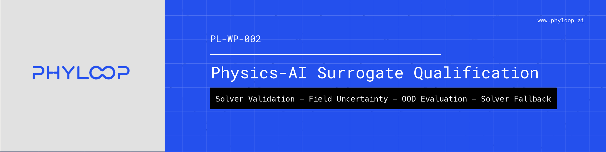
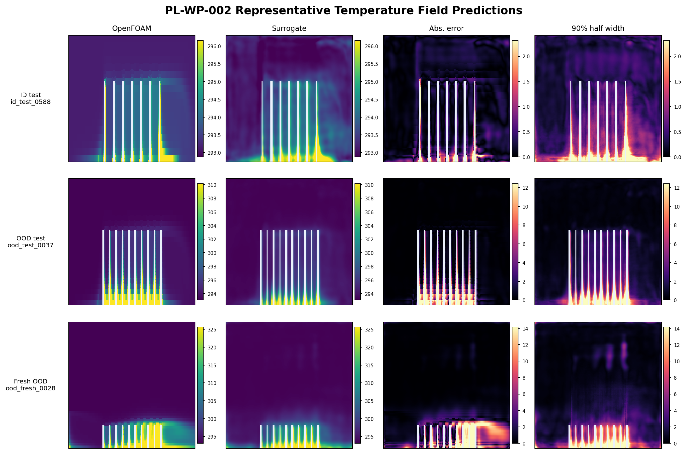
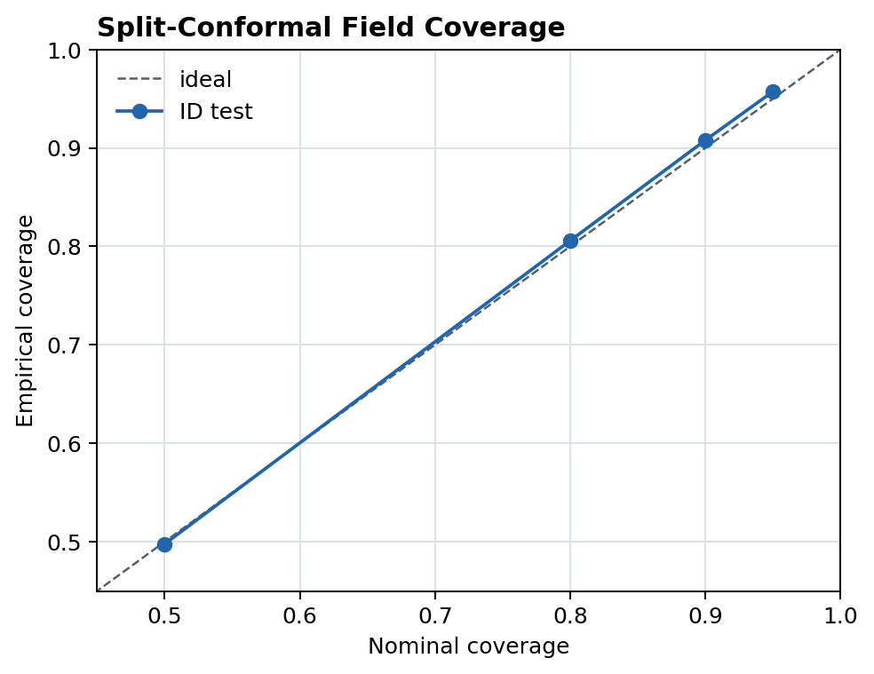
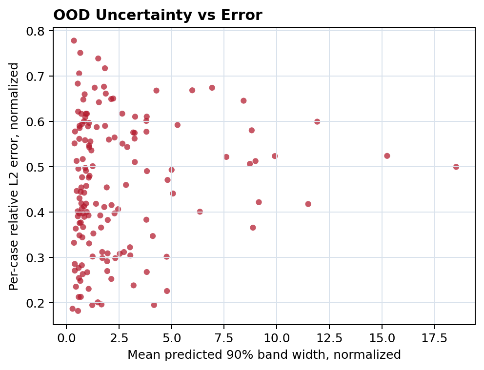

# Physics-AI Surrogate Qualification

[](https://github.com/phyloop-ai/physics-ai-surrogate-qualification/actions/workflows/tests.yml)
[](LICENSE)

Support code and evidence for **PL-WP-002: When Can a Physics-AI Surrogate Be Trusted?**

**Claim.** This repository demonstrates a solver-validated qualification workflow for physics-AI field surrogates: generate OpenFOAM evidence, retain only physically plausible cases, train a compact field surrogate, calibrate uncertainty, evaluate ID/OOD behavior, and route known envelope violations back to the solver.

**One-command public check:**

```bash
git clone https://github.com/phyloop-ai/physics-ai-surrogate-qualification.git
cd physics-ai-surrogate-qualification
make public-check
```

The public check creates a local venv, installs pinned dependencies, runs the pytest-collected test suite, and verifies the evidence chain used by the paper.

Expected evidence check:

```text
PL-WP-002 public-chain validation passed.
retained cases: 848
ID 90% aggregate coverage: 0.907814
explicit-envelope served coverage: 0.907814
```

## What This Shows

- Solver provenance for every retained training and evaluation case.
- Physical retention gates for convergence, thermal stability, raw outlet enthalpy, local-temperature extrema, and fixed-grid plausibility.
- Field prediction for temperature and velocity magnitude over the fluid mask.
- Split-conformal field uncertainty calibration.
- ID, constructed OOD, and fresh-OOD evaluation.
- Explicit envelope routing as the deployment baseline.
- Learned uncertainty and risk scores as supporting telemetry, not standalone gates.

## What This Does Not Show

This is not a production coolant model, a replacement for OpenFOAM, a certification artifact, or a general hidden-regime detector. It is a bounded benchmark and qualification pattern for deciding when a physics-AI field surrogate may support engineering work and when solver fallback remains required.

The current evidence supports known envelope shifts. It does not establish early detection of hidden physics-regime changes inside the declared envelope.

## Public Result

The field surrogate is calibrated inside the validated envelope at the target 90% level. Under constructed and fresh OOD shifts, error rises and uncertainty bands expand. However, learned uncertainty does not rank OOD errors strongly enough to serve as a standalone hidden-regime detector.

### Selected Evidence Figures



*OpenFOAM temperature fields, surrogate predictions, absolute error, and 90% half-width for representative ID, constructed OOD, and fresh-OOD cases.*



*Empirical ID field coverage tracks nominal coverage; the public check verifies 90% aggregate coverage at `0.907814`.*



*OOD uncertainty expands for many shifted cases, but bandwidth alone does not cleanly rank error; explicit envelope fallback remains the deployment baseline.*

The correct deployment reading is conservative:

- use explicit envelope checks as the primary fallback gate
- treat learned uncertainty and risk scores as telemetry
- route envelope violations back to the solver
- require additional geometry-family, mesh/fidelity, and hidden-regime studies before higher-consequence use

## Reproducibility

The fixed study seed is `20260603`, recorded in `configs/study_tier2_steady.toml` and the copied evidence config under `evidence_pack_tier2_steady/01_config/study.toml`.

The public CI path is intentionally lightweight:

```bash
make public-check
```

It runs:

- `make test`: 23 pytest-collected tests covering conformal calibration math, field-loss masking, solver-log parsing, thermal retention gates, acquisition/backfill accounting, envelope routing, learned-score routing, and public-release hygiene.
- `make pl-wp-002-public-check`: deterministic validation that reported metrics, figures, manifests, and prediction indices exist and remain mutually consistent.

The full OpenFOAM acquisition and training path is heavier and is not run in CI.

## Evidence Map

| Path | Purpose |
|---|---|
| `configs/study_tier2_steady.toml` | Physics, dataset, solver, and uncertainty contract for PL-WP-002. |
| `scripts/` | Case generation, solver orchestration, field extraction, validation, training, and diagnostics. |
| `src/pl_wp_002/` | Shared utilities used by the workflow. |
| `tests/` | Public test suite for numerical, solver-contract, routing, and release-hygiene checks. |
| `evidence_pack_tier2_steady/02_metrics/` | Published metrics and diagnostic summaries. |
| `evidence_pack_tier2_steady/03_data/` | Parameter tables, retained manifests, status ledgers, and acquisition summaries. |
| `evidence_pack_tier2_steady/04_predictions/` | Fixed-grid summaries and per-case prediction index files. |
| `evidence_pack_tier2_steady/05_figures/` | Scientific PNGs used by the public whitepaper. |

Large raw solver outputs, OpenFOAM case directories, model checkpoints, and per-case NPZ prediction tensors are intentionally not versioned.

## Full Solver Workflow

The full acquisition path requires an OpenFOAM-capable environment. In the original run, OpenFOAM execution was performed through a local VM. Configure the solver environment first:

```bash
export OPENFOAM_MULTIPASS_INSTANCE="<your-openfoam-vm-name>"
```

Main workflow targets:

```bash
make tier2-smoke
make tier2-physical-acquisition-evidence
make tier2-extract-physical-acquisition
make tier2-validate-physical-acquisition
make tier2-train-physical-operator
make tier2-gate-diagnostics
```

The full solver acquisition is compute-heavy and may take substantial wall-clock
time. Public releases may omit heavy raw solver archives, model checkpoints, and
per-case tensor files (`solver_outputs/`, `*.npz`, `*.pt`) while retaining their
manifests, hashes, summary metrics, and figures. That lightweight pack supports
metadata and metric-consistency review; a full local evidence pack, when present,
is needed to replay extraction, retraining, and per-case prediction artifacts
without rerunning OpenFOAM.

## Citation

If you use this repository, cite it using `CITATION.cff`.

## License

Apache-2.0. See `LICENSE`.

## Version

PL-WP-002 public support release: `v1.0.0`.
